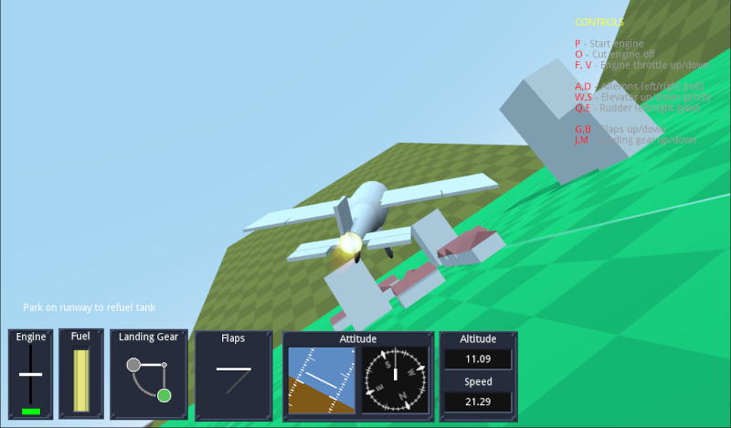
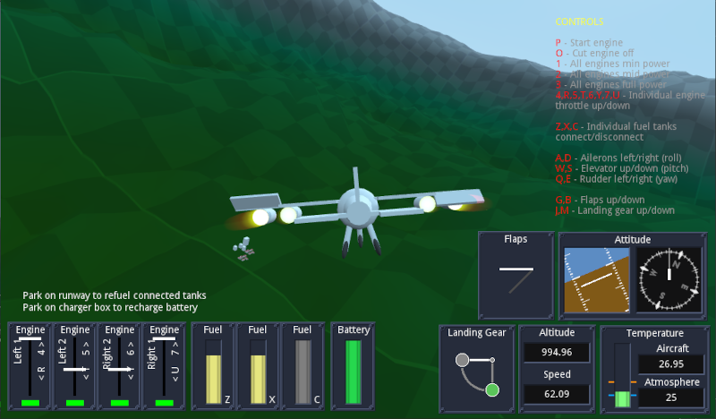
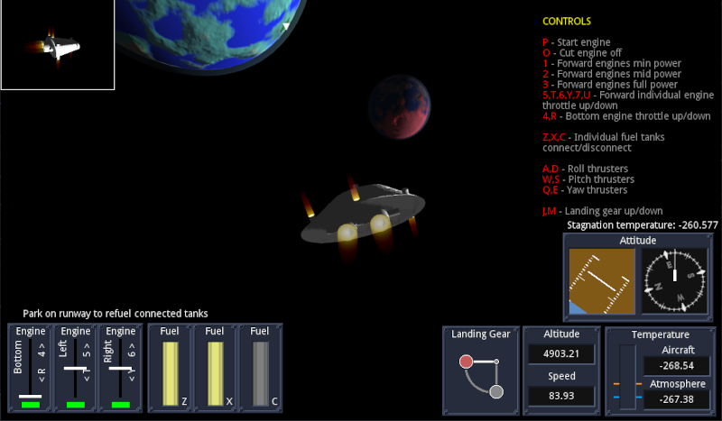
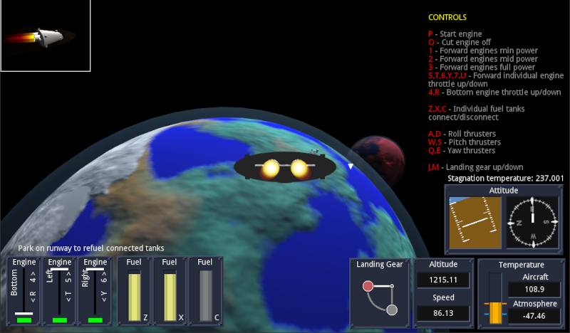
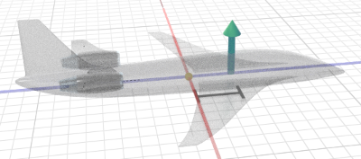
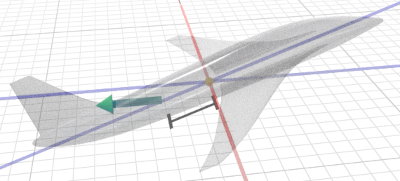

# Simplified Flight Simulation Library (addon) for Godot Engine

This addon in a simple flight simulation system, in pure GDScript, and generic enough to cover several types of aircrafts and spacecrafts.

There are very realistic flight simulation libraries elsewhere (usually in C), but if you only want your players to _vooosh_ and _pew pew_ around, a scientifically precise library is overkill. So this one is optimized for games, not pilot training.

### Simplified 

This is a _simplified_ library because we get rid of many headaches by doing simplifications.  Instead of many parameters (wing shape, area, material this, volume that, blabla yadda yadda), you just drop some values which you think feel right for your gameplay.

They are explained in more detail further down this file.

### Modular

This library is very flexible and covers a wide range of vehicle types, by being modular. Your plane is one `Aircraft` node and several _module_ nodes inside. 

The `Aircraft` node _per se_ does very little: only takes care of things happening to the fuselage itself (lift, drag, temperature, etc), and routes energy/fuel between modules. _Everything_ else is done by modules. You need an engine? Put an engine module. You need the player to control that engine (turn on, off, speed)? Put an engine control module. You need to steer the plane? Put a steering module and control it with a steering control module. Fuel? Fuel tank module.

This way, different combinations of modules result in different aircrafts. E.g. an airplane would have an air-based engine (e.g. propeller), which is affected by air density, while a spacecraft would have a rocket based engine, which would work regardless of air density, but is less efficient. Or an _aileron_ steering module would be passive, but only works in air, while a thruster based module works in zero speed, but uses fuel.

### Examples

This repository contains a project with the addon and 4 examples. They demonstrate how the modules can be used in the aircraft for different scenarios, how to update UI from the simulation as well as visual meshes, and also demonstrate different ways to achieve the same things. The "look-and-feel" of the user interface, instruments and etc does not belong to the addon, the art and layout is entirely game-dependent (you don't even need any UI at all to run the examples - they are just aesthetic).

The examples are:

- A simple airplane: one engine, one fuel tank (always connected), steering, flaps and landing gear, and ye olde instruments. Runway refuels your tank.

- A complex airplane: four engines (two each wing) with independent control, three fuel tanks with independent connection/disconnection control, steering system running on electricity, one central battery (always connected), flaps, landing gear, fuselage heating due to air friction and heat dissipation to surroundings, and air density and temperature based on altitude, and instruments. Runway refuels connected tanks and charging base refils battery. Also demonstrates the engine modules respect their 3D positions in the plane model.

- Helicopter:  one vertical engine, one fuel tank (always connected), steering, landing gear, and instruments. Demonstrates the engine modules respect their node rotation in the aircraft model, and that the simulation can work with zero lift (no fixed wing). The helicopter example represents all "copters" (e.g. quadcopter drones) as they all work similarly. Runway/pad refuels tank.

- Spaceship: two engines forward, one up, three independent fuel tanks, steering using fuelled thrusters, landing gear, instruments, fuselage heating calculations. This example demonstrates the use of spherical world: the gravity, altitude, air density and temperature, as well as the attitude (roll, pitch, compass bearing) are all calculated based on the location and rotation of a spherical planet (so you can actually land in the exact north or south poles and compass goes crazy). There are two planets each with their radius of influence, so all these parameters are only in effect when you are within the vicinity of that planet, and you can travel back and forth between both. When you are not in the area of either of the planets, gravity and air density are zero, and temperature is absolute zero K (-273.15 C).

----

## `Aircraft` node

The `Aircraft` node takes care of the overall behaviour of the aircraft fuselage, including air interaction with the body (drag), wings (lift), friction (heating), etc. This simulation uses Godot axes convention (unlike aerospace engineering), so -Z is forward, X is right, Y is up.

The node must have a `CollisionShape` child node and it should be a _**primitive**_ node (not trimesh). This is because in Godot collisions between Primitive-Primitive and Primitive-Trimesh are OK, but Trimesh-Trimesh is not. So the aircraft is a Primitive so the scenario can be a Trimesh.

If using a landing gear module, the `Aircraft` node must have a second `CollisionShape` node for the landing gear, explained in the `LandingGear` module.

The following parameters can be set:

- `Lift Factor`: How much lift is produced during flight - this joins all coefficients and wing area into a single number. Only air travelling parallel to the plane's `z` axis is relevant.

- `Lift Point Distance`: To simplify calculations and avoid wing distribution headaches, all lift is applied at a single point and wings are always symmetrical (left = right). Usually applying lift in the airplane origin (center of mass) works well, but if you need you can adjust the point (in the Z axis) where the lift is applied. This is a distance from center, where positive is towards the nose, and causes the plane to pitch up faster with lift. If in doubt, leave at `0`.

- `Drag Factor`: how much drag happens across each direction - `x` is the drag for wind hitting the side of the aircraft, `y` is the vertical drag, and `z` is the front drag. Due to wing shape, front drag is the least and must be less than the lift or the plane won't take off. Usually vertical drag is the largest as the vertical wind hits the wing surfaces directly.

- `Drag Point Distance`: the logic is the same as the lift, but unlike lift, the drag must be applied away from the origin to simulate the self-correcting effect of the aircraft tail. Just like the feathers in the back of an arrow, the higher air resistance in the tail when the plane is not aligned to velocity rotates the plane back to the velocity direction. By simply applying the drag force at a point behind the center we avoid all tail aerodynamic calculations. This _must not be zero_ and the largest the number, the more efficient the tail. The distance doesn't have to be inside the aircraft model.

- `Drag Heat Rate`: How fast the fuselage heats up at high speeds and cools down from colder winds (high number = bad thermal isolation).

- `Radiation Cooling`: How fast the fuselage cools down by simply radiating the heat. This effect is less relevant in aerial flight and would only be noticed in space games where there is no air to cool the ship, so this is the only parameter dissipating the heat.

- `Mach Speed Scaling`: Mach speed is how many times the speed is higher than speed of sound (e.g. Mach 2.5 means 2.5x the speed of sound). This is used to calculate heating. If your map is very small and you want high speed heating effects when the real velocity is actually still not that high, this parameter multiplies it (e.g. a value of `10` means 50m/s will heat as much as 500m/s would).

- `Max Temperature`: The temperature at which the aircraft will disintegrate (will emit the `crashed` signal even without touching anything). 

- `Enable Temperature Calculations`: If `false`, the node will save processing by ignoring and bypassing all the heating calculations. Anything involving temperature will therefore not work.

- `Air Density`: the air density used to calculate lift and drag, normalized to Earth's atmosphere at sea level, so you don't have to worry about units. That is, a value of `1.0` means "the same as surface of Earth". Can be changed during gameplay as result of things like altitude or planets, but can only be changed from inside the `atmospheric_calculations_requested` signal callback (otherwise calculations will crash and burn in that frame).

- `Air Temperature`: the external air temperature used to calculate heating and heat dissipation. All temperatures in this addon are exposed in Celsius (and done internally in Kelvin). If you'd prefer an exotic scale (e.g. Farenheit) you'd have to convert yourself. The same as air density applies: can be changed during gameplay as long as done inside the `atmospheric_calculations_requested` signal callback.

- `Max landing Force`: tolerance used to identify if the landing gear touched the ground with too much force and the plane should crash even if the landing gear touched first. If the velocity pressing the gear up is higher than this value, the `crashed` signal is emitted.

- `Gravity`: the gravity value normalized to Earth's gravity at sea level. That is, a gravity of `1.0` means "same gravity as Earth". The same as air density and temperature applies: can be changed during gameplay as long as done inside the `atmospheric_calculations_requested` signal callback.

- `Altitude Enabled`: if `false`, all altitude calculations are skipped and altitude is shown as `0`. Use this when the concept of altitude makes no sense, e.g. in space games when there is no planet around.

- `World Type`: can be `Linear` or `Spherical`. If `Linear`, references for where is up/down (gravity) and North (for compass) are always the same directions (not necessarily Godot's global axes), regardless of how much you travel or to where. If `Spherical`, the gravity vector is always towards a fixed central point and therefore "up" rotates as you travel, always pointing away front hat point. North and all compass directions are calculated assuming a magnetic field moving between north/south magnetic poles just like Earth, based on a reference axis (not necessarily Godot's global axes).

- `World Orientation Reference`: A reference `Spatial`-derived node for world orientation. If `World Type` is `Linear`, this node's `y` axis is the `up` direction (and therefore `-y` is gravity), and the node's `-z` is North (and therefore `x`=East, `z`=South and `-x`=West). The global position of this node is used for altitude calculations, the `y=0` defining the origin plane for sea level (see `Sea Level From Origin`). If `World Type` is `Spherical`, the global position of the reference node is the planet core center and all gravity points to that origin point, while the node's `y` axis (in global space) is the North axis working exactly like Earth.

- `Sea Level From Origin`: used to calculate the sea level (point where `altitude`=`0`). If `World Type` is `Linear`, this is an offset added to the reference node's `y` axis to set the sea level - e.g. if `15.0`, sea level will be 15 units high in the reference node's `y` axis. If `World Type` is `Spherical`, this is the distance from the reference node's origin (planet center) - e.g. if `15.0`, the planet has sea level radius of 15.

Any other configuration is done via modules.

Signals:

- `crashed`: Emitted when the plane is destroyed either by common impact, by excessive impact in the landing gear, by overheating, or by very high angular velocity. The high angular velocity ("spinning like crazy") usually happens when absurdly high speeds happen inside an atmosphere causing a drag so strong it brings the physics engine to an unstable state - the 60 fps physics framerate is not enough to process the changes and the `RigidBody` cannot recover naturally. Since that angular velocity would be unplayable and in real life would disintegrate the ship, here we crash so the nodes can be reset.

- `parked`: emitted when the aircraft stops moving and the landing gear (and only that) is touching a surface.

- `moved`: emitted when the aircraft was still and just started moving

- `atmospheric_calculations_requested`: emitted during physics calculations to indicate when it is safe to modify the air density, temperature and gravity.

----

## Modules

WIP