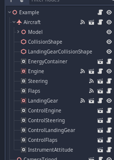
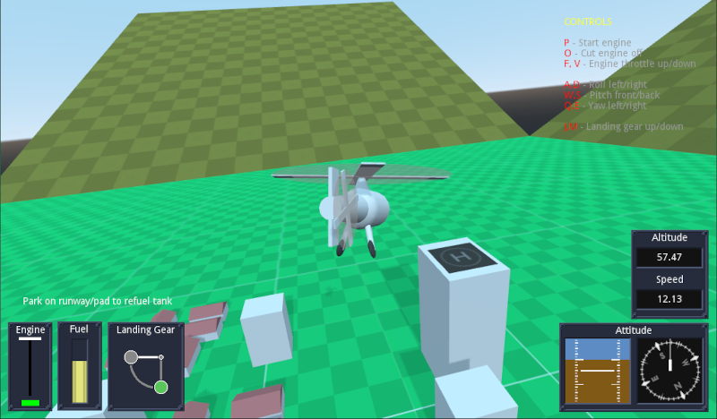
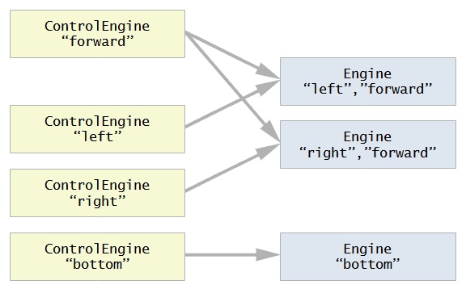
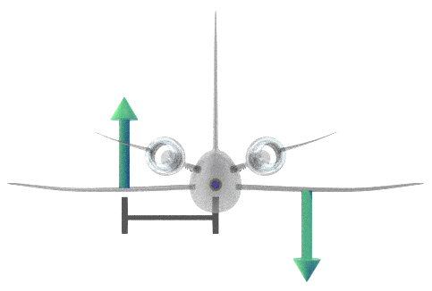

# Simplified Flight Simulation Library (addon) for Godot Engine

This addon in a simple flight simulation system, in pure GDScript, and generic enough to cover several types of aircrafts and spacecrafts.

_The `main` branch is for Godot 4. If you are using Godot 3.x, check branch `3.x`._

There are very realistic flight simulation libraries elsewhere (usually in C), but if you only want your players to _vooosh_ and _pew pew_ around, a scientifically precise library is overkill. So this one is optimized for games, not pilot training.

### Simplified 

This is a _simplified_ library because we get rid of many headaches by doing simplifications.  Instead of many parameters (wing shape, area, material this, volume that, blabla yadda yadda), you just drop some values which you think feel right for your gameplay.

They are explained in more detail further down this file.

### Modular

This library is very flexible and covers a wide range of vehicle types, by being modular. Your plane is one `Aircraft` node and several _module_ nodes inside. 

The `Aircraft` node _per se_ does very little: only takes care of things happening to the fuselage itself (lift, drag, temperature, etc), and routes energy/fuel between modules. _Everything_ else is done by modules. You need an engine? Put an engine module. You need the player to control that engine (turn on, off, speed)? Put an engine control module. You need to steer the plane? Put a steering module and control it with a steering control module. Fuel? Fuel tank module.



This way, different combinations of modules result in different aircrafts. E.g. an airplane would have an air-based engine (e.g. propeller), which is affected by air density, while a spacecraft would have a rocket based engine, which would work regardless of air density, but is less efficient. Or an _aileron_ steering module would be passive, but only works in air, while a thruster based module works in zero speed, but uses fuel.


### Examples

This repository contains a project with the addon and 4 examples. They demonstrate how the modules can be used in the aircraft for different scenarios, how to update UI from the simulation as well as visual meshes, and also demonstrate different ways to achieve the same things. The "look-and-feel" of the user interface, instruments and etc does not belong to the addon, the art and layout is entirely game-dependent (you don't even need any UI at all to run the examples - they are just aesthetic).

The examples are:

- A simple airplane: one engine, one fuel tank (always connected), steering, flaps and landing gear, and ye olde instruments. Runway refuels your tank.


- A complex airplane: four engines (two each wing) with independent control, three fuel tanks with independent connection/disconnection control, steering system running on electricity, one central battery (always connected), flaps, landing gear, fuselage heating due to air friction and heat dissipation to surroundings, and air density and temperature based on altitude, and instruments. Runway refuels connected tanks and charging base refils battery. Also demonstrates the engine modules respect their 3D positions in the plane model.


- Helicopter:  one vertical engine, one fuel tank (always connected), steering not based on forward velocity, landing gear, and instruments. Demonstrates the engine modules respect their node rotation in the aircraft model, and that the simulation can work with zero lift (no fixed wing). The helicopter example represents all "copters" (e.g. quadcopter drones) as they all work similarly. Runway/pad refuels tank.




- Spaceship: two engines forward, one up, three independent fuel tanks, steering using fuelled thrusters, landing gear, instruments, fuselage heating calculations. This example demonstrates the use of spherical world: the gravity, altitude, air density and temperature, as well as the attitude (roll, pitch, compass bearing) are all calculated based on the location and rotation of a spherical planet (so you can actually land in the exact north or south poles and compass goes crazy). There are two planets each with their radius of influence, so all these parameters are only in effect when you are within the vicinity of that planet, and you can travel back and forth between both. When you are not in the area of either of the planets, gravity and air density are zero, and external temperature is absolute zero K (-273.15 C).


----

## `Aircraft` node


The `Aircraft` node takes care of the overall behaviour of the aircraft fuselage, including air interaction with the body (drag), wings (lift), friction (heating), etc. This simulation uses Godot axes convention (unlike aerospace engineering), so -Z is forward, X is right, Y is up.

The node must have a `CollisionShape` child node and it should be a _**primitive**_ node (not trimesh). This is because in Godot collisions between Primitive-Primitive and Primitive-Trimesh are OK, but Trimesh-Trimesh is not. So the aircraft is a Primitive so the scenario can be a Trimesh.

If using a landing gear module, the `Aircraft` node must have a second `CollisionShape` node for the landing gear, explained in the `LandingGear` module.

The following parameters can be set:

- `Lift Factor`: How much lift is produced during flight - this joins all coefficients and wing area into a single number. Only air travelling parallel to the plane's `z` axis is relevant.

- `Lift Point Distance`: To simplify calculations and avoid wing distribution headaches, all lift is applied at a single point and wings are always symmetrical (left = right). Usually applying lift in the airplane origin (center of mass) works well, but if you need you can adjust the point (in the Z axis) where the lift is applied. This is a distance from center, where positive is towards the nose, and causes the plane to pitch up faster with lift. If in doubt, leave at `0`.


- `Drag Factor`: how much drag happens across each direction - `x` is the drag for wind hitting the side of the aircraft, `y` is the vertical drag, and `z` is the front drag. Due to wing shape, front drag is the least and must be less than the lift or the plane won't take off. Usually vertical drag is the largest as the vertical wind hits the wing surfaces directly.

- `Drag Point Distance`: the logic is the same as the lift, but unlike lift, the drag must be applied away from the origin to simulate the self-correcting effect of the aircraft tail. Just like the feathers in the back of an arrow, the higher air resistance in the tail when the plane is not aligned to velocity rotates the plane back to the velocity direction. By simply applying the drag force at a point behind the center we avoid all tail aerodynamic calculations. This _must not be zero_ and the largest the number, the more efficient the tail. The distance doesn't have to be inside the aircraft model.


- `Drag Heat Rate`: How fast the fuselage heats up at high speeds and cools down from colder winds (high number = bad thermal isolation).

- `Radiation Cooling`: How fast the fuselage cools down by simply radiating the heat. This effect is less relevant in aerial flight and would only be noticed in space games where there is no air to cool the ship, so this is the only parameter dissipating the heat.

- `Mach Speed Scaling`: Mach speed is how many times the speed is higher than speed of sound (e.g. Mach 2.5 means 2.5x the speed of sound). This is used to calculate heating. If your map is very small and you want high speed heating effects when the real velocity is actually still not that high, this parameter multiplies it (e.g. a value of `10` means 50m/s will heat as much as 500m/s would).

- `Max Temperature`: The temperature at which the aircraft will disintegrate (will emit the `crashed` signal even without touching anything). 

- `Enable Temperature Calculations`: If `false`, the node will save processing by ignoring and bypassing all the heating calculations. Anything involving temperature will therefore not work.

- `Air Density`: the air density used to calculate lift and drag, normalized to Earth's atmosphere at sea level, so you don't have to worry about units. That is, a value of `1.0` means "the same as surface of Earth". Can be changed during gameplay as result of things like altitude or planets, but can only be changed from inside the `atmospheric_calculations_requested` signal callback (otherwise calculations will crash and burn in that frame).

- `Air Temperature`: the external air temperature used to calculate heating and heat dissipation. All temperatures in this addon are exposed in Celsius (and done internally in Kelvin). If you'd prefer an exotic scale (e.g. Farenheit) you'd have to convert yourself. The same as air density applies: can be changed during gameplay as long as done inside the `atmospheric_calculations_requested` signal callback.

- `Max landing Force`: tolerance used to identify if the landing gear touched the ground with too much force and the plane should crash even if the landing gear touched first. If the velocity pressing the gear up is higher than this value, the `crashed` signal is emitted.

- `Gravity`: the gravity value normalized to Earth's gravity at sea level. That is, a gravity of `1.0` means "same gravity as Earth". The same as air density and temperature applies: can be changed during gameplay as long as done inside the `atmospheric_calculations_requested` signal callback.

- `Altitude Enabled`: if `false`, all altitude calculations are skipped and altitude is shown as `0`. Use this when the concept of altitude makes no sense, e.g. in space games when there is no planet around.

- `World Type`: can be `Linear` or `Spherical`. If `Linear`, references for where is up/down (gravity) and North (for compass) are always the same directions (not necessarily Godot's global axes), regardless of how much you travel or to where. If `Spherical`, the gravity vector is always towards a fixed central point and therefore "up" rotates as you travel, always pointing away front that point. North and all compass directions are calculated assuming a magnetic field moving between north/south magnetic poles just like Earth, based on a reference axis (not necessarily Godot's global axes).

- `World Orientation Reference`: A reference `Spatial`-derived node for world orientation. If `World Type` is `Linear`, this node's `y` axis is the `up` direction (and therefore `-y` is gravity), and the node's `-z` is North (and therefore `x`=East, `z`=South and `-x`=West). The global position of this node is used for altitude calculations, the `y=0` defining the origin plane for sea level (see `Sea Level From Origin`). If `World Type` is `Spherical`, the global position of the reference node is the planet core center and all gravity points to that origin point, while the node's `y` axis (in global space) is the North axis working exactly like Earth. If not provided (left empty), Godot's global axes will be used (for both modes).

- `Sea Level From Origin`: used to calculate the sea level (point where `altitude`=`0`). If `World Type` is `Linear`, this is an offset added to the reference node's `y` axis to set the sea level - e.g. if `15.0`, sea level will be 15 units high in the reference node's `y` axis. If `World Type` is `Spherical`, this is the distance from the reference node's origin (planet center) - e.g. if `15.0`, the planet has sea level radius of 15.


Any other configuration is done via modules.

Signals:

- `crashed`: Emitted when the plane is destroyed either by common impact, by excessive impact in the landing gear, by overheating, or by very high angular velocity. The high angular velocity ("spinning like crazy") usually happens when absurdly high speeds happen inside an atmosphere causing a drag so strong it brings the physics engine to an unstable state - the 60 fps physics framerate is not enough to process the changes and the `RigidBody` cannot recover naturally. Since that angular velocity would be unplayable and in real life would disintegrate the ship, here we crash so the nodes can be reset.

- `parked`: emitted when the aircraft stops moving and the landing gear (and only that) is touching a surface.

- `moved`: emitted when the aircraft was still and just started moving

- `atmospheric_calculations_requested`: emitted during physics calculations to indicate when it is safe to modify the air density, temperature and gravity.

----

## Modules

Each module can receive input, process physics, and output information, all optionally. 

Those are usually decoupled: there are modules altering the aircraft behaviour (e.g. `Steering`), modules receiving input to control them (e.g. `ControlSteering`) and modules to display information which is not tied to another module (e.g. `InstrumentAttitude` for altitude, compass, etc). When information is tied to a module, that module can output the information directly (e.g. the engine's current power in an `Engine` module is emitted by the `Engine` module itself), but an `Instrument` could be used to read grouped or indirect information from other modules (e.g. a `InstrumentTotalEnergy` which could read the level of all energy container modules and show the total). 

Modules which alter the aircraft have direct names (e.g. `Engine`, `Steering`, etc), modules which control other modules have the `Control` prefix (e.g. `ControlEngine`, `ControlSteering`) and modules which read information from the aircraft or other modules have the `Instrument` prefix (e.g. `InstrumentAttitude`). 

Modules can find each other via module type and tags: both are `String` identifiers, the difference being the module type is a single string fixed for all instances of that module (e.g. all engine modules have module type `"engine"`), while tags are a list of user defned strings which can be in any amount and different for each instance. Modules searching for other modules by tag will find any modules containing that tag, regardless of other tags (e.g. a module searching for "engine" with the tag "left" will find all modules with type "engine" having the tag "left" in their list of tags).

The tasks are decoupled (between action and control modules) to allow switching modules without unnecessary work on shared parts (e.g. replacing the type of landing gear doesn't need rework on input processing, UI, etc), but also to allow cases when modules and their controls are not 1:1. The _Example 4 - Spaceship_ demonstrates this: there is a group of engines "forward" with the "left" and "right" engines, and a "bottom" engine, so there are three `Engine` modules, but there are four `ControlEngine` modules: one for each individual engine (using the tags "left", "right", "bottom") and one to simultaneously control both the forward engines (using the "forward" tag).



You must use the modules' own system to implement tasks (instead of Godot's internal `_input()`, `_physics_process(delta)`, etc) because the aircraft has to be changed/interacted at the correct times for it to work properly - so the aircraft calls the module methods, not the game engine. E.g: on each physics frame, the aircraft calculates internal state variables, then calls the modules' `process_physic_frame(delta)` method, and then applies lift and drag using the values (optionally) modified by the modules (or externally). So any physics in the modules _must_ be in their `process_physic_frame` method, not in `_physics_process`. Same for everything else: the logic presented here must be respected.

All modules inherit from either `AircraftModule` (descending from `Node`) or `AircraftModuleSpatial` (descending from `Spatial`). Use the second only if you need 3D coordinates in the module (e.g. `Engine` which uses its position and rotation to apply forces), otherwise use the first to save CPU.

All of this sounds very intimidating, but often end up being simple. As example, here is a minimalist flaps module (which doesn't do any error checking or animations, but still works):

```swift
extends AircraftModule

signal update_interface(values)

export(float) var LiftFlapFactor = 1.2
export(float) var DragFlapFactor = 1.25

var flap_position = 0.0

func _ready():
	ProcessPhysics = true
	ModuleType = "flaps"

func process_physic_frame(_delta):
    aircraft.lift_intensity *= lerp(1.0, LiftFlapFactor, flap_position)          # apply LiftFlapFactor proportionally
    aircraft.drag_intensity_vector.z *= lerp(1.0, DragFlapFactor, flap_position) # apply DragFlapFactor proportionally

func flap_set_position(value: float):
    flap_position = clamp(value, 0.0, 1.0)
    emit_signal("update_interface", {"flap": flap_position })

func flap_increase_position(step: float):
    flap_set_position(flap_position + step)

```

And here is a minimalist control flap module to go along with that one:

```swift
extends AircraftModule

export(bool) var ControlActive = true

var flaps_module = null

func _ready():
	ReceiveInput = true
    
func setup(aircraft_node):
	aircraft = aircraft_node
	flaps_module = aircraft.find_modules_by_type("flaps").pop_front()

func receive_input(event):
	if ControlActive:
		if Input.is_action_just_pressed("decrease_flaps):
			flaps_module.flap_increase_position(-0.2)
		if Input.is_action_just_pressed("increase_flaps):
			flaps_module.flap_increase_position(0.2)

```

No special node configuration needed. Just drop these two nodes as children of your aircraft and your flaps are already working and good to go. (You should put some error checking and polishing in there, but you get the idea.)

#### Properties

All modules have the following properties:

- `Receive Input`: set to `true` when this module receives user input, to let the aircraft know it has to call `receive_input(event)` on this module. If this is set, the module _must_ implement the `receive_input(event)` method (works the same way as `_unhandled_input(event)`)

- `Process Physics`: set to `true` when this module runs code in the physics frame, to let the aircraft know it has to call `process_physics_frame(delta)` on this module. If this is set, the module _must_ implement the `process_physics_frame(delta)` method (works the same was as `_physics_process(delta)`)

- `Process Render`: set to `true` when this module runs code in the rendering frame (e.g. moving cameras), to let the aircraft know it has to call `process_render_frame(delta)` on this module. If this is set, the module _must_ implement the `process_render_frame(delta)` method (works the same was as `_process(delta)`). If you have multiple cameras in your aircraft (as you can have cameras as part of modules) this ensures they are all updated in the same uninterrupted game engine call, which avoids delays and flickering (specially when using separate viewports with their own worlds)

- `Module Type`: a string identifier for this type of module, set in code (in the module' `_ready()` method). Can be changed in the inspector but usually should not, as it identifies the type of module. Change this only if the module works in a different way

- `Module Tags`: an array of string identifiers used by other modules to find this one. Usually not set in code, just in the inspector, as it may be different for each module instance

- `Uses Energy`: implementation depends on type of module, usually indicates if the operation of this module should deplete some type of energy (fuel, battery, etc)

- `Energy Type`: implementation depends on type of module, the type of energy used by the `Uses Energy` feature


- `UINode`: although not strictly enforced by the system and not part of the base class, this property is usually implemented in the modules which output information. Assign a node in the scene tree to have its `update_interface(values)` method automatically connected to the module's `update_interface` signal. You don't really _need_ this, as the signal can be connected normally to any node - it's just a convenience.


#### Methods

The following methods are predefined (implement only the ones you'll use):

- `setup(aircraft_node)`: called on all modules after the aircraft system is set and ready (that is, modules can now find each other, energy types and capacities are calculated, etc). While `_ready` is the game engine's "ready" call, `setup` is the aircraft system's "ready" call (happens after `_ready` but in the same frame). If omitted, the default implementation is:

```swift
func setup(aircraft_node):
	aircraft = aircraft_node
```

So if you implement it yourself you _**must**_ include the `aircraft = aircraft_node` line. If your module emits state information (e.g. for UI) it is important to emit a first time here to make sure UI shows with initialized values.

- `receive_input(event)`: when `Receive Input` is set, this method is called by the aircraft on every unhandled input event

- `process_physic_frame(delta)`: when `Process Physics` is set, this method is called by the aircraft on every physics frame. At the moment it is called, state variables are already calculated (air velocity, forward air speed, mach speed, lift intensity, drag intensity, altitude, gravity, available energy budget for all energy types, etc, including call to `atmospheric_calculations_requested` signal), but nothing is applied to the aircraft's `RigidBody` yet - they are applied after all modules are processed

- `process_render_frame(delta)`: when `Process Render` is set, this method is called by the aircraft on every rendering frame. Nothing special is done before or after the call, but moving cameras here (and not in `_process`) ensures all camera movements are in sync (using `_process` directly with overlayed viewports can cause visible delays and flickering)

#### Signals

The following signals are predefined (implement only if used):

- `update_interface(values)`: emitted when internal information has changed in the module which needs to be known externally (e.g. for UI, model visual feedback, etc). The `values` argument is a dictionary where the format is dependent on each module, but all output information from this module must be in this dictionary in this signal (not separate signals for different variables)

----

## Module Sets

Modules can have specific properties, methods and signals when they are expected to be paired to other modules made as part of a same module set - e.g. all `Engine` modules have the `engine_set_power` method which is called by all `ControlEngine` modules, as `Engine` and `ControlEngine` types consist of a module set. In that case, when creating a new module to be used in an existing set, the existing formats must be respected.

Currently implemented sets:
- EnergyContainer
- Engine
- Steering
- Flaps
- LandingGear

The descriptions below show the minimum required implementation to respect the system. Modules in this repository will have more optional features implemented (such as animations and sound loops).


#### EnergyContainer Set

Energy containers (think fuel tanks) store energy and are used by the aircraft to calculate energy budgets (how much energy is available to modules). They are a special type of module because energy containers are the only modules the aircraft itself searches for and interacts directly (instead of leaving the modules to just talk to each other). Energy in the aircraft has types, identified by strings (e.g. "fuel", "battery", etc). There is no limit to the amount of types you can have, and they have no predefined meaning.

Energy containers can be connected or disconnected from the system. When they are disconnected, they are treated as if they were not there, but still hold their charge values (as if they were removed and stored away, as they were). 

All connected containers of the same type have their values added together to form the "energy budget" of that energy type. When modules request energy, the value is taken from the energy budget and all connected containers of that type are depleted, proportional to their contribution. Similarly, when the aircraft is loaded with energy ("refuel"/"recharge"), only connected containers are charged, and loading energy is split equally between them.

All `EnergyContainer` modules have `Module Type` as `"energy_container"` and have the following properties:

- `Energy Type`: a `String` identifier for the type of energy stored in this container. Can be anything and interpretation is game-dependent

- `Max Capacity`: the amount of energy stored in this container when it is full

- `Container Active`: if this container is connected to the aircraft's energy pool or not


The following methods are implemented:

- `consume_energy(value)`: consumes energy directly from this container. Called internally from aircraft's energy distribution system. Calling from another module consumes energy without using the aircraft's energy distribution system and even if the container is disconnected. Avoid calling this manually unless you have a very good reason (e.g. to implement a damaged container which leaks)

- `load_energy(value)`: charges energy into the container directly. Called internally from aircraft's energy distribution system. Calling from another module loads energy without using the aircraft's energy distribution system and even if the container is disconnected. Avoid calling this manually unless you have a very good reason (e.g. Thor decides to charge a battery using lightning from his hammer like in _Avengers: Age of Ultron_)

- `energy_container_toggle_active()`: toggles the `Container Active` value between `true` = connected and `false` = disconnected

This module implements the `update_interface(values)` signal.


All `ControlEnergyContainer` modules affect only modules with `Module Type` as `"energy_container"`, and have the following properties:

- `Restrict Energy Container To Tag`: if set to `true` via inspector, the `Search Tag` property becomes effective

- `Search Tag`: if `Restrict Energy Container To Tag` is set, only containers having the tag specified by `Search Tag` will be affected by this module

- `ControlActive`: if set to `false`, the module will no longer be responding

Actual input implementation in the `ControlEnergyContainer` module is game-specific and the code provided in this repository (body of `receive_input` method) is only for example purposes.


#### Engine Set


There can be any number of `Engine` modules in an aircraft. All `Engine` modules have `Module Type` set as `"engine"`, and have the following properties:


- `Energy Type`: the type of energy (from the aircraft's energy container system) used as fuel for this engine

- `Fuel Rate`: fuel units consumed per second, when the engine is at its full power (consumption is proportional to power). Engines always have `Uses Energy` set, so if you don't want to use any energy, set `Fuel Rate` to `0`

- `Power Factor`: a multiplier for the physical force applied by this engine (how "strong" it is)


Engines are `Spatial`-derived nodes and therefore have a 3D position and rotation, which is respected when applying forces. Force is applied at the engine position and toward's the module's `-z`.


Engines have the following methods:

- `engine_start()`: engines start off and this has to be called prior to using any of the other methods. Can also be used as flag for visual purposes (e.g. _Example 3 - Helicopter_ uses this as flag to rotate the propeller)

- `engine_stop()`: stops the engine (back to reset state)

- `engine_set_power(value)`: sets the current engine power to the normalized value (`0.0` is no power, `1.0` is full power)

- `engine_increase_power(step)`: increases (or decreases if negative `step`) the engine power by `step`, properly handling end-of-scale and only if the value actually changed (e.g. if the engine is at power `1.0`, increasing doesn't change the value and doesn't emit signals)


This module implements the `update_interface(values)` signal.


All `ControlEngine` modules affect only modules with `Module Type` as `"engine"`, and have the following properties:

- `Restrict Engine To Tag`: if set to `true` via inspector, the `Search Tag` property becomes effective

- `Search Tag`: if `Restrict Engine To Tag` is set, only engines having the tag specified by `Search Tag` will be affected by this module

- `ControlActive`: if set to `false`, the module will no longer be responding

Actual input implementation in the `ControlEngine` module is game-specific and the code provided in this repository (body of `receive_input` method) is only for example purposes.


#### Steering Set


There can be only one `Steering` module at a time in an aircraft. All `Steering` modules have `Module Type` set as `"steering"`, and have the following properties:

- `Steering Type`: can be `Air Passive` or `Thrusted`. If `Air Passive`, steering depends on air density and forward speed. If `Thrusted`, steering happens independently. (Internally the forces are always applied as thrusters, but if `Air Passive`, force is multiplied by normalized air density and velocity.)

- `Power Factor`: a multiplier for the physical force applied by the steering thrusters (how "strong" it is)

- `XPointDistance`, `YPointDistance` and `ZPointDistance`: the distance for forces applied for `x`, `y` and `z` rotations respectively. This works the same way as drag application point: force is applied this distance from origin, translating into torque (rotation). The further from the center, the more efficient the steering.



- `Uses Energy`: if `true`, using this steering system consumes energy. If then the energy is not available, module ceases to work

- `Energy Type`: if `Uses Energy` is set, this is the energy type requested from the aircraft's energy system

- `Fuel Rate`: energy units consumed per second, when the steering is at its full power, per axis (consumption is proportional to axis strength), if `Uses Energy` is set


Steering modules have the following methods:

- `set_x(value)`: sets the pitch rotation (in the range `-1.0` to `1.0`, where positive pitches the nose up, and `0.0` is not steering)

- `set_y(value)`: sets the yaw rotation (in the range `-1.0` to `1.0`, where positive yaws the nose left, and `0.0` is not steering)

- `set_z(value)`: sets the roll rotation (in the range `-1.0` to `1.0`, where positive rolls the roof right, and `0.0` is not steering - notice this axis is actually `-z`)


This module implements the `update_interface(values)` signal.


There can be only one `ControlSteering` module at a time in an aircraft. All `ControlSteering` modules affect only modules with `Module Type` as `"steering"`, and have the following properties:

- `ControlActive`: if set to `false`, the module will no longer be responding

Actual input implementation in the `ControlSteering` module is game-specific and the code provided in this repository (body of `receive_input` method) is only for example purposes.


#### Flaps Set

There can be only one `Flaps` module at a time in an aircraft. All `Flaps` modules have `Module Type` set as `"flaps"`, and have the following properties:


- `Lift Flap Factor`: aircraft's lift is multiplied by this when flaps are fully deployed (partially deployed flaps are proportional) - e.g. `1.2` means 20% more lift with flaps

- `Drag Flap Factor`: aircraft's drag in forward direction is multiplied by this when flaps are fully deployed (partially deployed flaps are proportional) - e.g. `1.2` means 20% more drag with flaps. Drag in other directions is not affected


Flaps modules have the following methods:

- `flap_set_position(value)`: sets the current flap position to the normalized value (`0.0` is fully stowed, `1.0` is fully deployed)

- `flap_increase_position(step)`: increases (or decreases if negative `step`) the flap position by `step`, properly handling end-of-scale and only if the value actually changed (e.g. if the position is `1.0`, increasing doesn't change the value and doesn't emit signals)

This module implements the `update_interface(values)` signal.


There can be only one `ControlFlaps` module at a time in an aircraft. All `ControlFlaps` modules affect only modules with `Module Type` as `"flaps"`, and have the following properties:

- `ControlActive`: if set to `false`, the module will no longer be responding

Actual input implementation in the `ControlFlaps` module is game-specific and the code provided in this repository (body of `receive_input` method) is only for example purposes.


#### Landing Gear Set

There can be more than one `LandingGear` in an aircraft (e.g. wheels for runways and stand pads for mud). Currently there is no implementation to restrict movement direction when landed (that is, wheels will slide sideways as well). All `LandingGear` modules have `Module Type` set as `"landing_gear"`, and have the following properties:

- `Gear Collision Shape`: the `CollisionShape` node, child of the `Aircraft` node, to use for landing gear collision detection. Collision with this shape will not cause a crash, unless the velocity is higher than the aircraft's `MaxLandingForce`. When the landing gear is stowed, this collision shape will be disabled, and enabled when deployed

- `Initial State`: can be `Stowed` or `Deployed`, and sets the initial position of the landing gear when the scene gameplay starts

Landing gear modules have the following methods implemented:

- `deploy()`: deploys the landing gear

- `stow()`: stows the landing gear

This module implements the `update_interface(values)` signal.


All `ControlLandingGear` modules affect only modules with `Module Type` as `"landing_gear"`, and have the following properties:

- `Restrict Gear To Tag`: if set to `true` via inspector, the `Search Tag` property becomes effective

- `Search Tag`: if `Restrict Gear To Tag` is set, only landing gears having the tag specified by `Search Tag` will be affected by this module

- `ControlActive`: if set to `false`, the module will no longer be responding

Actual input implementation in the `ControlLandingGear` module is game-specific and the code provided in this repository (body of `receive_input` method) is only for example purposes.